# C3S3: Complementary Competition and Contrastive Selection for Semi-Supervised Medical Image Segmentation

[](https://2025.ieeeicme.org/)
[](https://arxiv.org/abs/2506.07368)
[](https://github.com/Y-TARL/C3S3)

> **Official PyTorch implementation of "C3S3: Complementary Competition and Contrastive Selection for Semi-Supervised Medical Image Segmentation" (ICME 2025)**

## 🎉 News

- **[2025.03]** 🔥 Paper accepted at **ICME 2025**!

## 📖 Abstract

For the immanent challenge of insufficiently annotated samples in the medical field, semi-supervised medical image segmentation (SSMIS) offers a promising solution. Despite achieving impressive results in delineating primary target areas, most current methodologies struggle to precisely capture the subtle details of boundaries. This deficiency often leads to significant diagnostic inaccuracies.

To tackle this issue, we introduce **C3S3**, a novel semi-supervised segmentation model that synergistically integrates **complementary competition** and **contrastive selection**. This design significantly sharpens boundary delineation and enhances overall precision.

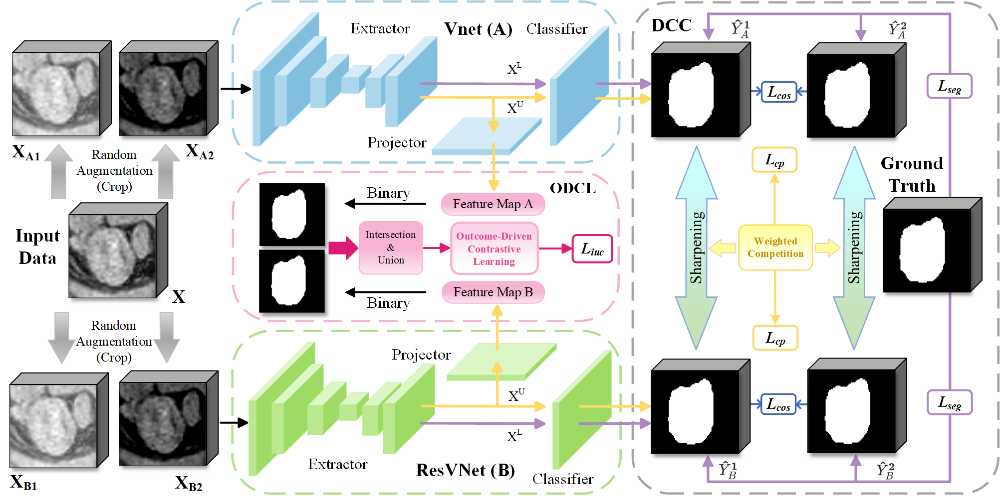

## 🌟 Key Features

### 🔥 Core Innovations

1. **Outcome-Driven Contrastive Learning (ODCL)** 📍

   - Dedicated to refining boundary localization
   - Spatial Position Binary Masking
   - Dual-Space Intersection-Union Loss
2. **Dynamic Complementary Competition (DCC)** ⚡

   - Leverages two high-performing sub-networks
   - Generates high-quality pseudo-labels
   - Minimizes reliance between student and teacher networks


### 📊 Performance Highlights

- **State-of-the-art results** on LA and Pancreas-CT datasets
- **Boundary precision**: Significant improvements in 95HD metric (LA: 5.14 vs 5.63 voxels; Pancreas: 6.96 vs 7.34 voxels)
- **Segmentation accuracy**: Best Dice scores on LA dataset (91.24%) and competitive on Pancreas (80.93%)
- **Efficient training** with only 2500 iterations per dataset

## 🏆 Results

### Left Atrium Segmentation (LA Dataset)

| Method                | 95HD (voxel)↓ | ASD (voxel)↓  | Dice (%)↑      | Jaccard (%)↑   |
| --------------------- | -------------- | -------------- | --------------- | --------------- |
| UA-MT                 | 7.54           | 2.31           | 88.82           | 80.18           |
| SASSNet               | 8.75           | 3.10           | 89.29           | 80.85           |
| DTC                   | 7.36           | 2.15           | 89.45           | 81.01           |
| SS-Net                | 6.96           | 1.84           | 90.21           | 82.36           |
| MCF                   | 6.68           | 2.02           | 88.02           | 79.51           |
| CAML                  | 6.11           | 1.68           | 90.78           | 83.19           |
| TraCoCo               | 5.63           | 1.79           | 90.94           | 83.47           |
| **C3S3 (Ours)** | **5.14** | **1.57** | **91.24** | **84.01** |

### Pancreas Segmentation (Pancreas-CT Dataset)

| Method                | 95HD (voxel)↓ | ASD (voxel)↓  | Dice (%)↑      | Jaccard (%)↑   |
| --------------------- | -------------- | -------------- | --------------- | --------------- |
| UA-MT                 | 17.06          | 5.23           | 74.02           | 60.10           |
| SASSNet               | 13.89          | 3.56           | 73.58           | 59.73           |
| DTC                   | 13.18          | 3.75           | 73.31           | 59.26           |
| SS-Net                | 12.64          | 3.59           | 74.27           | 60.56           |
| MCF                   | 11.59          | 3.27           | 75.00           | 61.27           |
| CauSSL                | 8.11           | 2.34           | 79.97           | 67.32           |
| TraCoCo               | 7.34           | 1.84           | 80.90           | 69.26           |
| **C3S3 (Ours)** | **6.96** | **1.74** | **80.93** | **68.06** |

### Visual Comparisons


#### Left Atrium Dataset Static Results
<div align="center">
  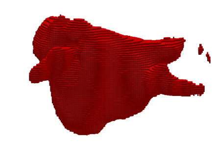
  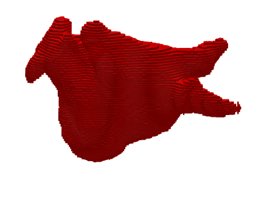
  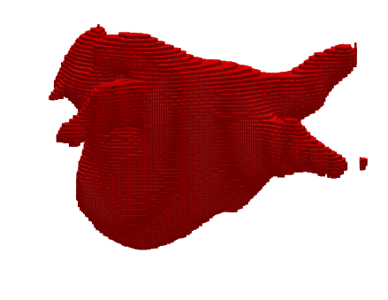
  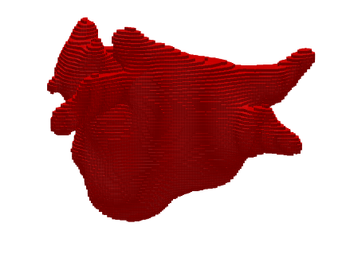
  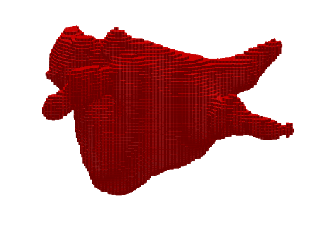
  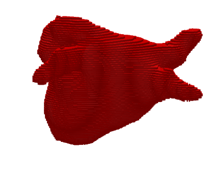
  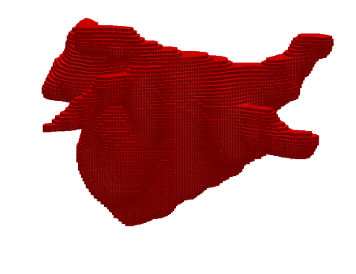
</div>

*LA dataset segmentation comparison: **UA-MT** | **DTC** | **MCF** | **CAML** | **TraCoCo** | **C3S3 (Ours)** | **Ground Truth***

#### Pancreas Dataset Static Results
<div align="center">
  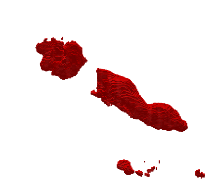
  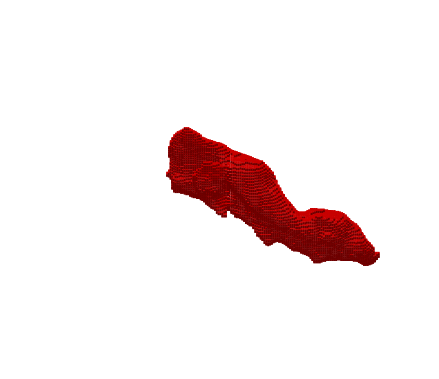
  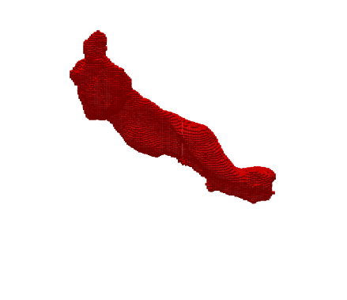
  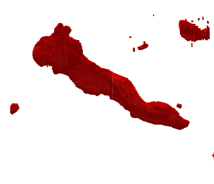
  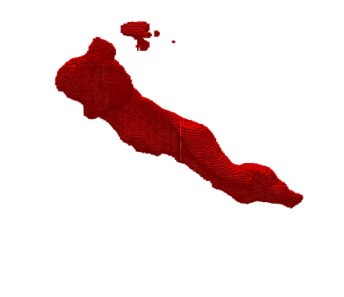
  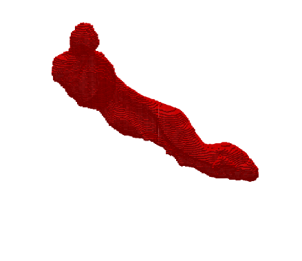
  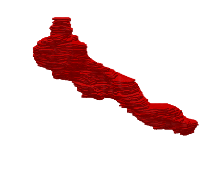
</div>

*Pancreas dataset segmentation comparison: **UA-MT** | **DTC** | **MCF** | **CauSSL** | **TraCoCo** | **C3S3 (Ours)** | **Ground Truth***

#### Animation Results

<div align="center">
  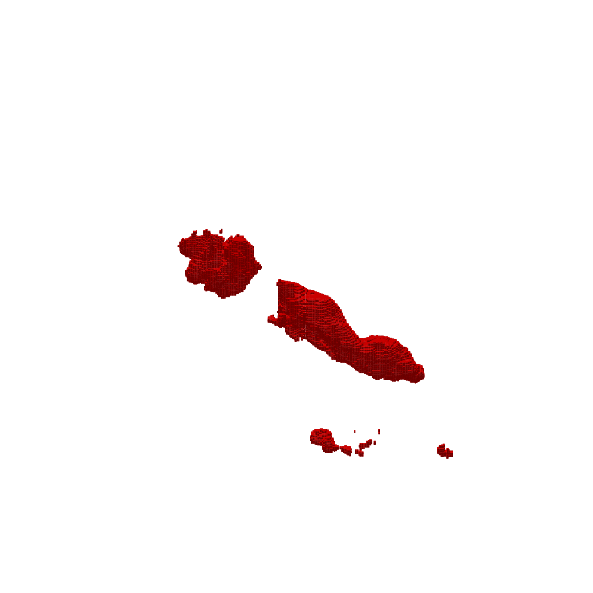
  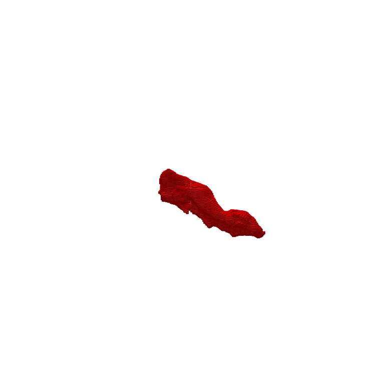
  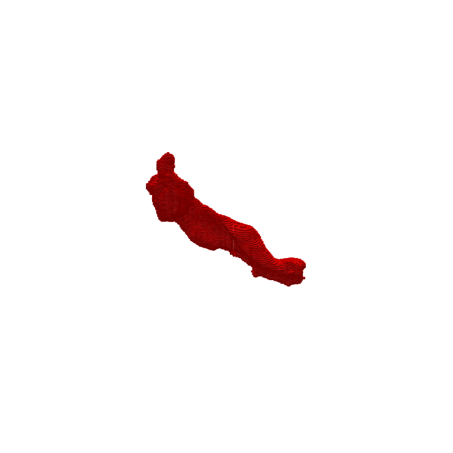
  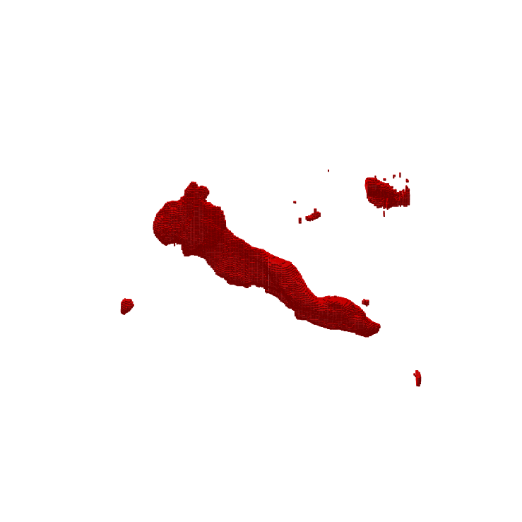
  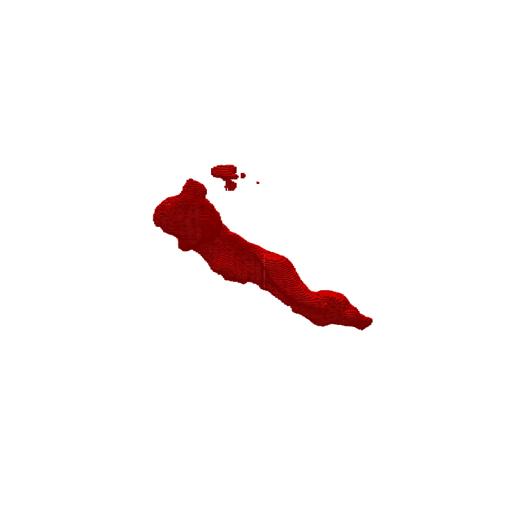
  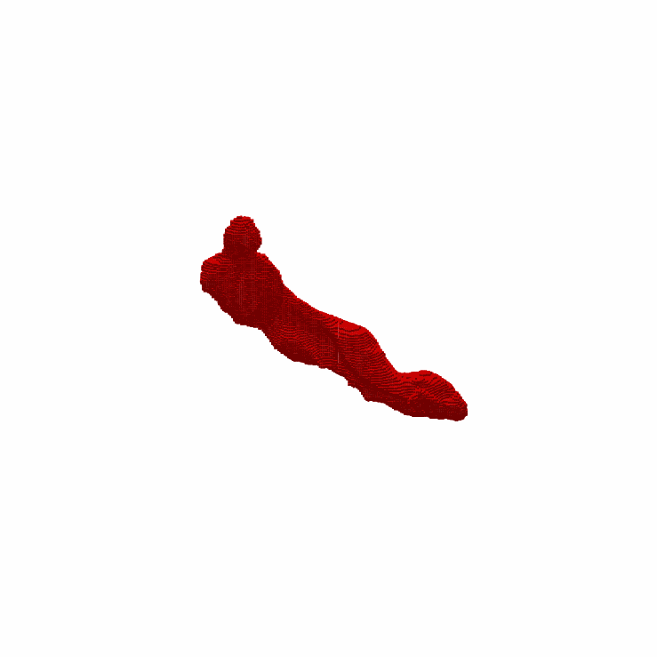
  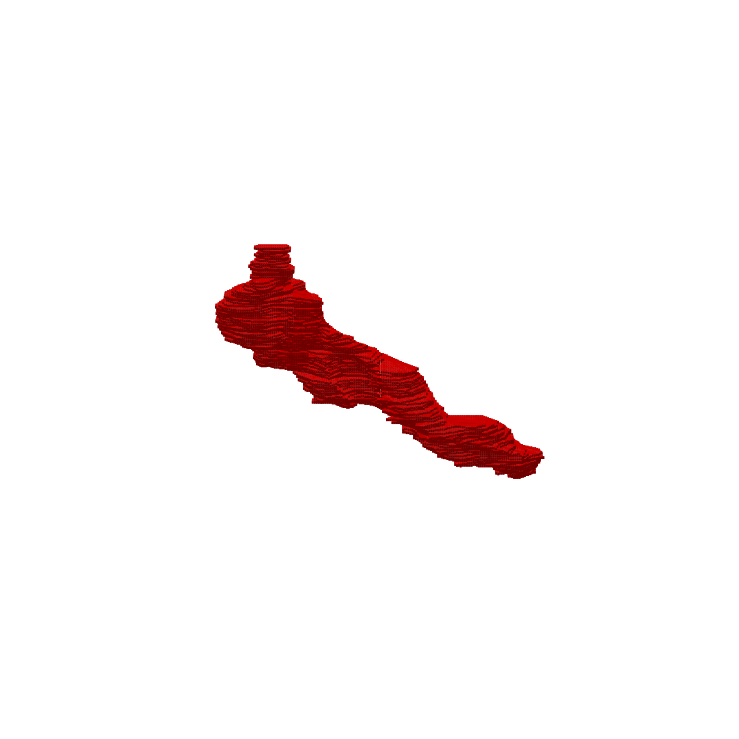
</div>

*Pancreas dataset segmentation animation comparison: **UA-MT** | **DTC** | **MCF** | **CauSSL** | **TraCoCo** | **C3S3 (Ours)** | **Ground Truth***

**Animation Analysis**: These dynamic visualizations demonstrate the 3D segmentation process on the Pancreas-CT dataset, showing slice-by-slice progression through the volume. Key observations:
- **C3S3** exhibits the most consistent and accurate boundary delineation across all slices
- **Boundary precision**: C3S3 maintains sharp, well-defined pancreas boundaries compared to other methods
- **Volume consistency**: Our method shows superior volumetric coherence with minimal segmentation gaps or false positives
- **Temporal stability**: C3S3 demonstrates the most stable segmentation quality throughout the entire volume sequence

#### Technical Advantages Demonstrated

The animation sequences highlight several key technical advantages of C3S3:

1. **🎯 Superior Boundary Localization**: Through Outcome-Driven Contrastive Learning (ODCL), C3S3 achieves precise boundary delineation that remains consistent across different anatomical regions and slice positions.

2. **🔄 Dynamic Adaptation**: The Dynamic Complementary Competition (DCC) mechanism enables adaptive pseudo-label generation, resulting in more robust segmentation performance across varying image quality and contrast conditions.

3. **📐 Volumetric Coherence**: Unlike baseline methods that may produce inconsistent results between adjacent slices, C3S3 maintains excellent 3D consistency, crucial for clinical applications requiring accurate volume measurements.

4. **⚡ Computational Efficiency**: Despite superior performance, C3S3 maintains computational efficiency with only 2500 training iterations, making it practical for real-world deployment.

## 🚀 Quick Start

### Environment Setup

```bash
# Clone the repository
git clone https://github.com/Y-TARL/C3S3.git
cd C3S3

# Create conda environment
conda create -n c3s3 python=3.7
conda activate c3s3

# Install PyTorch (CUDA 12.1 recommended)
pip install torch==2.2.1 torchvision==0.17.1 torchaudio==2.2.1 --index-url https://download.pytorch.org/whl/cu121

# Install all other dependencies
pip install -r requirements.txt

# Alternative: Install core dependencies individually
pip install numpy==1.21.5 scipy==1.10.1 scikit-learn==1.3.2 pandas==2.0.3
pip install SimpleITK==2.3.1 MedPy==0.4.0 nibabel==5.2.1
pip install scikit-image==0.21.0 opencv-python==4.9.0.80
pip install tensorboardX==2.6.2.2 tqdm==4.66.2 wandb==0.18.7
```

### Dataset Preparation

We provide the dataset structure for both LA and Pancreas-CT datasets:

```text
dataset/
├── LA/
│   ├── LA_Data/
│   │   ├── 06SR5RBREL16DQ6M8LWS/
│   │   ├── 0RZDK210BSMWAA6467LU/
│   │   ├── 1D7CUD1955YZPGK8XHJX/
│   │   └── ... (100 cases total: 80 train + 20 test)
│   └── Flods/
│       ├── train0.list
│       └── test0.list
└── Pancreas/
    ├── Pancreas-CT/
    │   ├── PANCREAS_0001_norm.h5
    │   ├── PANCREAS_0002_norm.h5
    │   └── ... (82 cases total: 62 train + 20 test)
    └── Flods/
        ├── train0.list
        └── test0.list
```

**Dataset Details:**
- **LA Dataset**: 100 total MR volumes (80 for training: 16 labeled + 64 unlabeled for 20% setting; 20 for testing)
- **Pancreas Dataset**: 82 total CT scans (62 for training: 12 labeled + 50 unlabeled for 20% setting; 20 for testing)
- **Data Format**: Preprocessed and stored in H5 format for efficient training

### Training

```bash
# Train on LA dataset (20% labeled data)
python train_LA.py --exp LA_20percent --max_iterations 2500 --gpu 0 --alpha 0.8 --consistency 0.1

# Train on Pancreas-CT dataset (20% labeled data)
python train_Pancreas.py --exp Pancreas_20percent --max_iterations 2500 --gpu 0 --alpha 0.5 --consistency 0.1
```

### Testing

```bash
# Test on LA dataset (modify iters in test.py to match your trained model)
python test.py --root_path ./dataset/LA/ --model LA_20percent --gpu 0

# Test on Pancreas dataset
python test.py --root_path ./dataset/Pancreas/ --model Pancreas_20percent --gpu 0
```

**Note**: The test script loads both VNet and ResNet models from `checkpoints/{model_name}/` directory. Make sure to update the `iters` variable in `test.py` to match your trained model iteration (default: 6000, but your training uses 2500).

## 🧠 Method Overview

### Technical Architecture

Our C3S3 framework employs a **dual-teacher architecture** where VNet and ResNet34 serve as complementary learners, each providing unique perspectives on medical image features. The Dynamic Complementary Competition mechanism dynamically selects the better-performing network for pseudo-label generation, while Outcome-Driven Contrastive Learning focuses specifically on boundary refinement through spatial position binary masking.

### Loss Function Design

The total training objective combines four complementary terms:
- **L_sup**: Supervised learning on labeled data (Cross-entropy + Dice)
- **L_cp**: Competition-based pseudo-supervision for unlabeled data  
- **L_iuc**: Intersection-Union Contrastive loss for boundary enhancement
- **L_cos**: Consistency regularization via cosine similarity

### Dynamic Complementary Competition Algorithm

The core DCC algorithm for pseudo-label generation:

```pseudocode
Algorithm: Dynamic Complementary Competition Module

Input: Labeled data X^L, Unlabeled data X^U
Output: Pseudo labels Y_P^U1, Y_P^U2

1. X ← {X^L, X^U}
2. X^1, X^2 ← Augmentation(X), Augmentation(X)
3. T ← 0.1
4. ce, dice ← 0, 0
5. Ŷ^L1_A, Ŷ^U1_A ← Softmax(A(X^1))
6. Ŷ^L2_A, Ŷ^U2_A ← Softmax(A(X^2))
7. Ŷ^L1_B, Ŷ^U1_B ← Softmax(B(X^1))
8. Ŷ^L2_B, Ŷ^U2_B ← Softmax(B(X^2))

9. For each y_i^L ∈ Y^L and predictions:
10.   For (N, L) ∈ {(A, L1), (A, L2), (B, L1), (B, L2)}:
11.     ce_N^L ← ce_N^L + (2/batch) × L_ce(ŷ_{N,i}^L, y_i^L)
12.     dice_N^L ← dice_N^L + (2/batch) × L_dice(ŷ_{N,i}^L, y_i^L)

13. ce_A, dice_A ← ce_A^L1 + ce_A^L2, dice_A^L1 + dice_A^L2
14. ce_B, dice_B ← ce_B^L1 + ce_B^L2, dice_B^L1 + dice_B^L2
15. L_competition^A ← α × ce_A + (1-α) × dice_A
16. L_competition^B ← α × ce_B + (1-α) × dice_B

17. If L_competition^A < L_competition^B:
18.   P1 ← ŷ_A^U1; P2 ← ŷ_A^U2
19. Else:
20.   P1 ← ŷ_B^U1; P2 ← ŷ_B^U2

21. Y_P^U1 ← P1^(1/T) / (P1^(1/T) + (1-P1)^(1/T))
22. Y_P^U2 ← P2^(1/T) / (P2^(1/T) + (1-P2)^(1/T))
23. Return Y_P^U1, Y_P^U2
```

This algorithm dynamically selects the better-performing backbone (VNet or ResNet) based on their competition loss to generate high-quality pseudo-labels for unlabeled data.

## 📊 Comprehensive Ablation Study

Based on our rebuttal materials, here's the complete ablation analysis:

| Components           | ODCL (L_iuc) | DCC (L_cp) | Consistency (L_cos) | 95HD↓         | ASD↓          | Dice↑          | Jaccard↑       |
| -------------------- | ------------ | ---------- | ------------------- | -------------- | -------------- | --------------- | --------------- |
| Baseline             | ✗           | ✗         | ✗                  | 12.04          | 2.21           | 84.46           | 76.38           |
| + ODCL               | ✓           | ✗         | ✗                  | 7.76           | 1.99           | 85.77           | 77.03           |
| + DCC                | ✗           | ✓         | ✗                  | 8.21           | 2.08           | 85.29           | 77.16           |
| + ODCL + DCC         | ✓           | ✓         | ✗                  | 7.14           | 1.91           | 85.89           | 78.21           |
| + Consistency        | ✗           | ✗         | ✓                  | 6.97           | 2.03           | 87.12           | 80.14           |
| + DCC + Consistency  | ✗           | ✓         | ✓                  | 6.27           | 1.86           | 90.18           | 82.26           |
| + ODCL + Consistency | ✓           | ✗         | ✓                  | 5.64           | 1.81           | 89.92           | 81.88           |
| **Full C3S3**  | ✓           | ✓         | ✓                  | **5.14** | **1.57** | **91.24** | **84.01** |

### Key Insights:

- **Consistency regularization** provides the largest individual improvement (+2.66 Dice, +3.76 Jaccard)
- **ODCL** delivers substantial boundary precision gains (95HD: 12.04→7.76, 35% improvement)
- **DCC** enhances segmentation robustness with competitive pseudo-labeling
- **Synergistic effects** emerge when combining all components (Full C3S3 vs. best dual combination: +1.06 Dice)
- **Boundary precision**: C3S3 achieves 8.7% improvement in 95HD on LA dataset (5.14 vs 5.63 voxels)
- **Surface accuracy**: 6.5% improvement in ASD on LA dataset (1.57 vs 1.68 voxels)
- **Boundary metrics** (95HD, ASD) benefit more from ODCL, while **overlap metrics** (Dice, Jaccard) favor consistency regularization

## 📝 Implementation Details

### Hardware Requirements

- **GPU**: NVIDIA 3090 (24GB) or equivalent

### Training Details

- **Optimizer**: SGD with momentum=0.9
- **Weight Decay**: 0.0001
- **Learning Rate**: 0.01 with polynomial decay
- **Batch Size**: 2 (1 labeled + 1 unlabeled)
- **Augmentation**: Random rotation, flip, crop
- **Iterations**: 2500 for both datasets

## 📚 Citation

If you find this work useful for your research, please cite:

```bibtex
@misc{he2025c3s3complementarycompetitioncontrastive,
      title={C3S3: Complementary Competition and Contrastive Selection for Semi-Supervised Medical Image Segmentation}, 
      author={Jiaying He and Yitong Lin and Jiahe Chen and Honghui Xu and Jianwei Zheng},
      year={2025},
      eprint={2506.07368},
      archivePrefix={arXiv},
      primaryClass={cs.CV},
      url={https://arxiv.org/abs/2506.07368}, 
}
```

